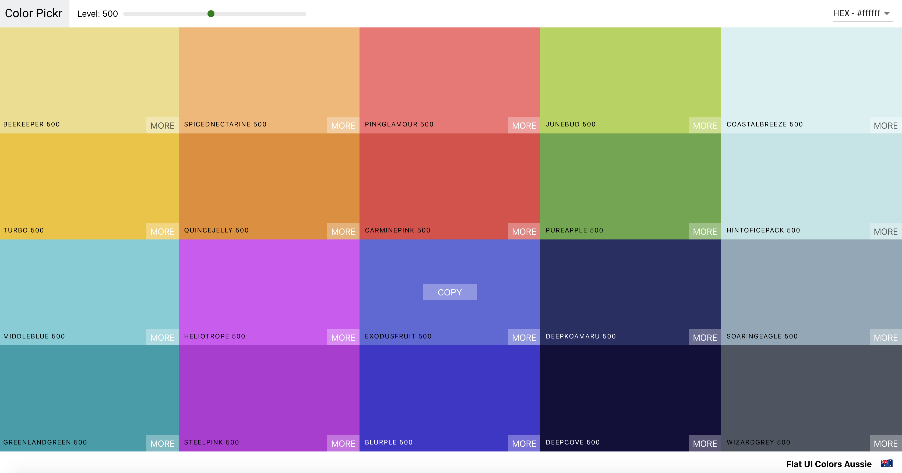
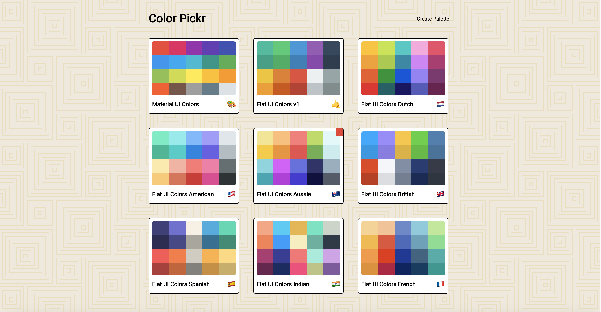
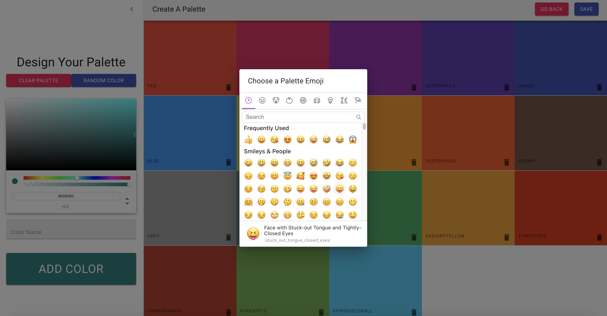

# [Color Pickr](https://colorpickrapp.netlify.app/)

Color Pickr App built using React.JS and Material UI. A clone of websites like [Flat UI Colors](https://flatuicolors.com/) and [Material UI Colors](http://materialuicolors.co/?utm_source=launchers).

- [Deployed front-end](https://colorpickrapp.netlify.app/)

## Short demo:

## Tech Stack

- Dependencies
  - "@material-ui/core": "^4.10.0"
  - "@material-ui/icons": "^4.9.1"
  - "@material-ui/styles": "^4.10.0"
  - "@testing-library/jest-dom": "^4.2.4"
  - "@testing-library/react": "^9.3.2"
  - "@testing-library/user-event": "^7.1.2"
  - "chroma-js": "^2.1.0"
  - "emoji-mart": "^3.0.0"
  - "rc-slider": "^9.2.4"
  - "react": "^16.13.1"
  - "react-color": "^2.18.1"
  - "react-copy-to-clipboard": "^5.0.2"
  - "react-dom": "^16.13.1"
  - "react-material-ui-form-validator": "^2.0.10"
  - "react-router-dom": "^5.2.0"
  - "react-scripts": "3.4.1"
  - "react-sortable-hoc": "^1.11.0"
  - "react-transition-group": "^4.4.1"
